# 06 — Dashboard UI walkthrough

A screen-by-screen tour of the Next.js admin dashboard. Every screenshot below is
a **real capture** of the running app (`make edge` + `make edge-dashboard`),
logged in as a tenant owner with seeded keys, usage, and a team.

The dashboard is a thin **BFF** over the [admin API](./02-admin-guide.md): each
page calls `/api/gw/<path>`, which attaches your session JWT and forwards to the
gateway. So everything here maps 1:1 to an API call you could script.

- [Access & sign in](#access--sign-in)
- [The app shell](#the-app-shell)
- [API Keys](#api-keys) · [Usage](#usage--cost-analytics) · [Spend](#spend) ·
  [Models](#models) · [Routing](#routing) · [Members](#members) · [Teams](#teams) ·
  [Audit](#audit) · [Alerts](#alerts) · [SLO](#slo) · [Health](#health) ·
  [Chat](#chat-playground) · [Settings](#settings)
- [AI-app pages](#ai-app-pages)

---

## Access & sign in

```bash
make edge              # gateway + edge (see Getting started)
make edge-dashboard    # builds + serves the dashboard → http://localhost:3000
```

Open `http://localhost:3000`. Unauthenticated visits to `/app/*` redirect to
`/login`.

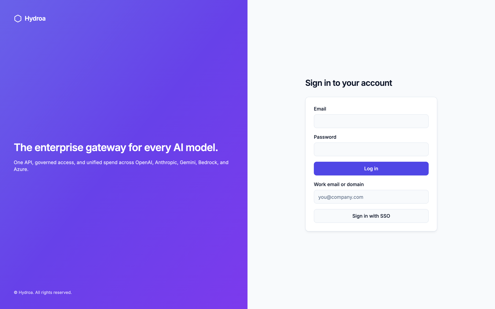

The split-screen sign-in offers **password** login (email + password → a session
JWT stored as the `ai_proxy_session` HttpOnly cookie) and **Sign in with SSO**
(enter your work email domain → redirected to your tenant’s OIDC IdP, if the owner
configured one — see [Admin §10](./02-admin-guide.md#10-sso--oidc)). New tenants
start at `/signup`.

---

## The app shell

After login you land in the authenticated app. A persistent left sidebar carries
every surface; your identity and role sit at the bottom (`owner.demo@example.com /
Owner`). The sidebar groups **AI-app** pages (Chat, Voice, Memory, Artifacts,
Vision, Video) above **operations** pages (Usage, Spend, API Keys, Models, Teams,
Members, Routing, Alerts, Audit, Health, SLO, Settings).

---

## API Keys

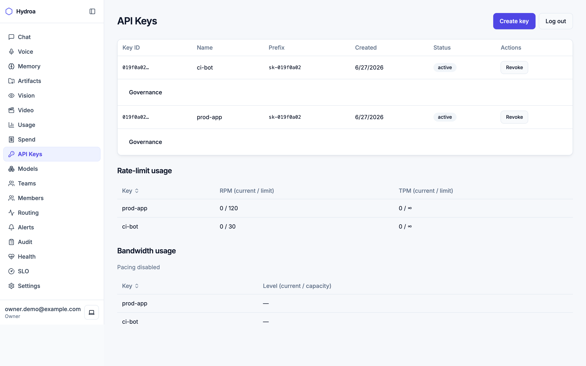

The default landing page. Create, list, and revoke `sk-` keys; each row shows its
safe **prefix**, status, and a **Governance** expander (budget, model allowlist,
RPM/TPM). Below, **Rate-limit usage** shows live RPM/TPM counters per key
(`prod-app 0/120`, `ci-bot 0/30`) and **Bandwidth usage** shows pacing buckets.
Maps to `/admin/keys`, `/admin/ratelimits`, `/admin/bandwidth`. _“Create key”_
returns the plaintext key once — copy it then.

---

## Usage & cost analytics

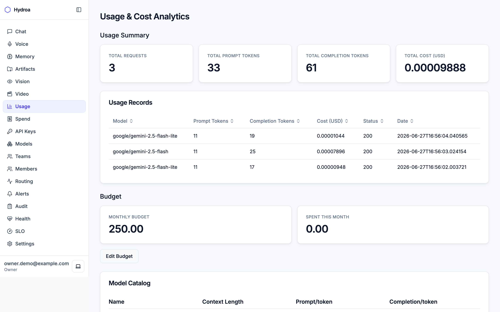

All-time **Usage Summary** (requests, prompt/completion tokens, total cost) plus a
**Usage Records** table (model, tokens, cost, status, timestamp) — here showing the
three seeded Gemini calls totalling `$0.00009888`. A **Budget** panel shows the
monthly ceiling vs. spend (`250.00` / `0.00`) with an **Edit Budget** action, and a
**Model Catalog** section. Maps to `/admin/usage` + `/admin/budget` +
`/admin/catalog/models` (the priced model list, read on the JWT/admin plane — the
control-plane twin of `/v1/models`, so a browser session never has to touch the
`sk-`-only data plane).

---

## Spend

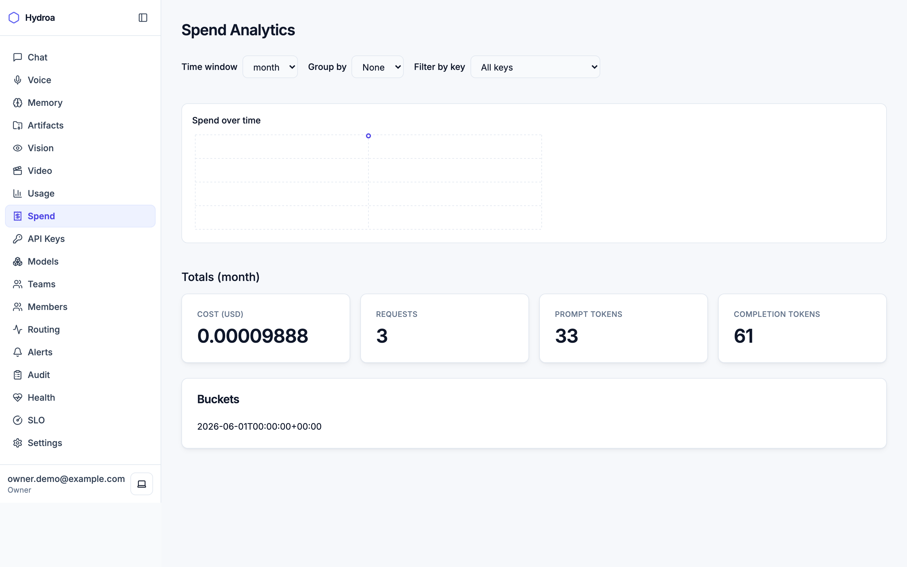

Windowed spend analytics (day / week / month) with bucketed totals and optional
breakdown by key or team — the time-series view of cost. Maps to `/admin/spend`.

---

## Models

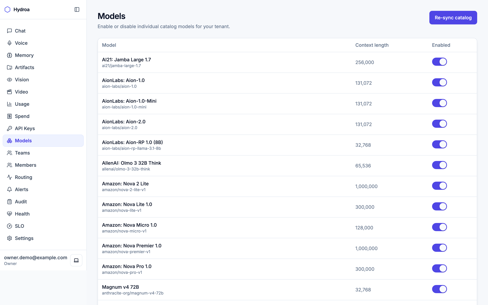

The synced catalog (339 models after a sync), each with context length and a
per-tenant **enable/disable** toggle, plus a **Sync** action. Disabled models
return `403 ERR_MODEL_DISABLED` to clients. Maps to `/admin/models` +
`/admin/catalog/sync`.

---

## Routing

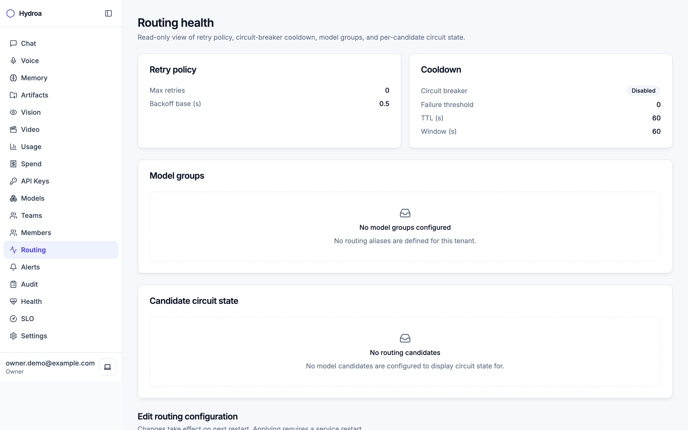

Read view of the effective **retry policy**, **cooldown / circuit-breaker** state,
**model groups**, and per-candidate **circuit state** (closed / open). The edit
form notes _“Changes take effect on next restart”_ — routing config is
**restart-to-apply** ([Admin §8](./02-admin-guide.md#8-routing-configuration)).
Maps to `/admin/routing`.

---

## Members

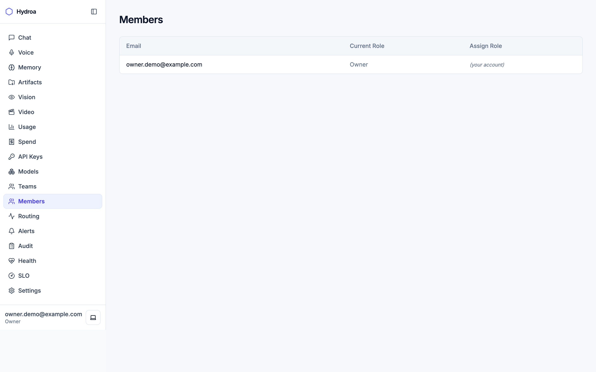

The tenant’s users and their roles, with role assignment (owner/admin only;
self-change and privilege-escalation are blocked). Maps to `/admin/users` +
`PUT /admin/users/{id}/role`. See the [role matrix](./04-multi-tenant-guide.md#roles--permissions).

---

## Teams

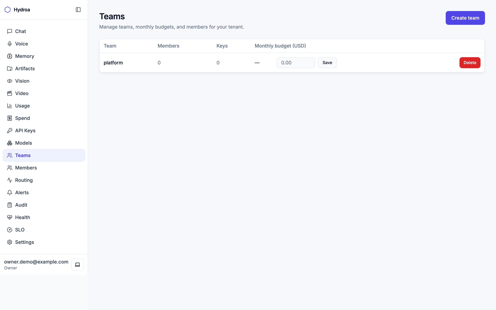

Create teams, set a shared **team budget**, and manage membership; keys can be
attributed to a team for budget pooling. Maps to `/admin/teams`.

---

## Audit

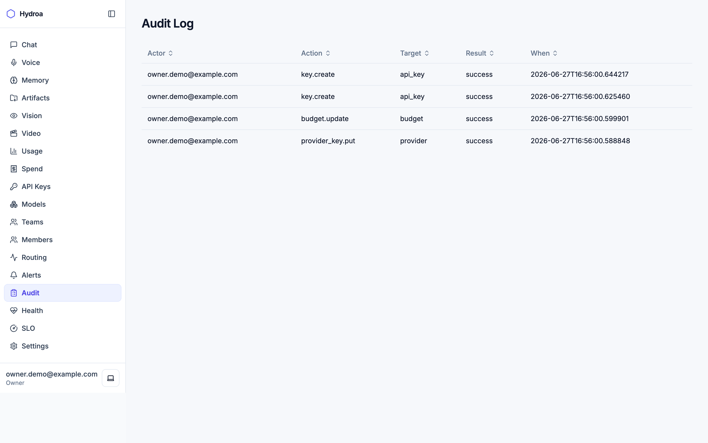

The append-only **audit log** — actor, action, target, result, timestamp — for
every privileged change (`key.create`, `budget.update`, `provider_key.put`,
`routing.update`, `user.role_assign`, …). Immutable by DB trigger. Maps to
`/admin/audit` (`audit_read`).

---

## Alerts

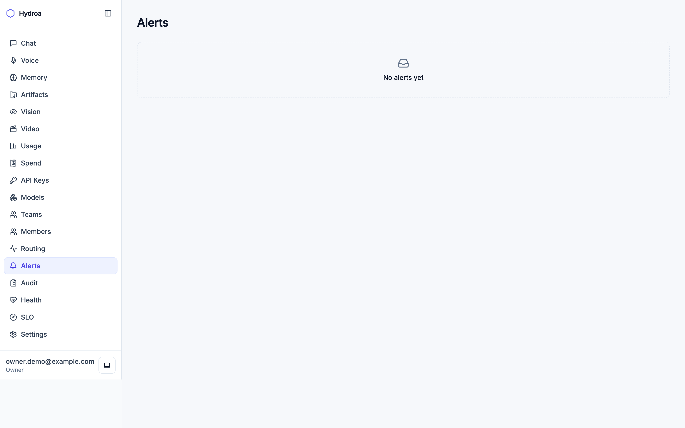

Alert / event history — your tenant’s rows **plus** platform-wide system events
(circuit-open, upstream-health changes, reconciliation drift). Maps to
`/admin/alerts` (`ops_read`).

---

## SLO

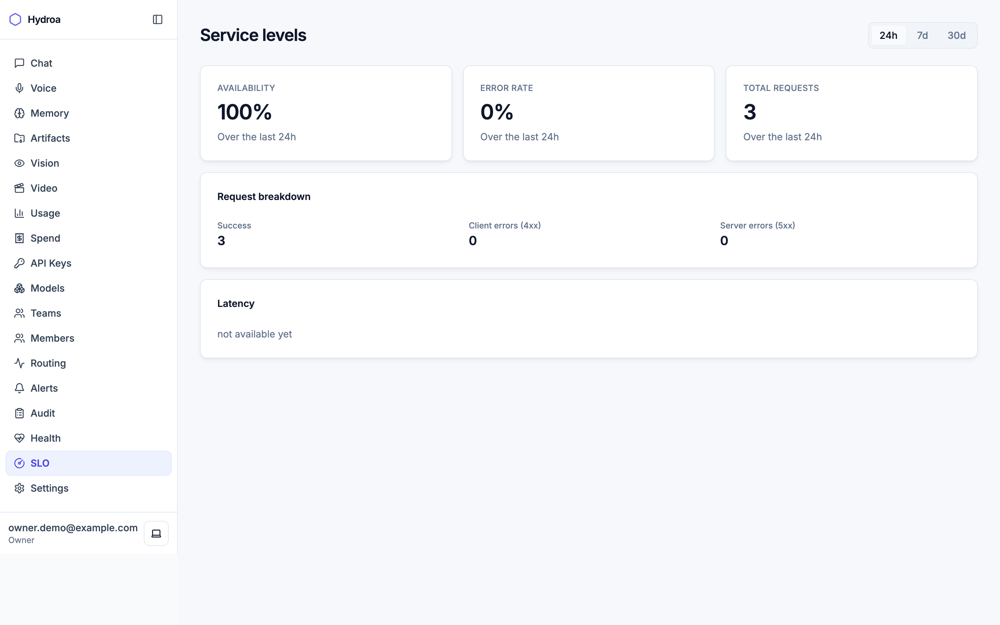

Availability and error-rate over a window (success vs. client/server errors).
`latency_ms` is intentionally blank — latency isn’t stored (honest omission). Maps
to `/admin/slo`.

---

## Health

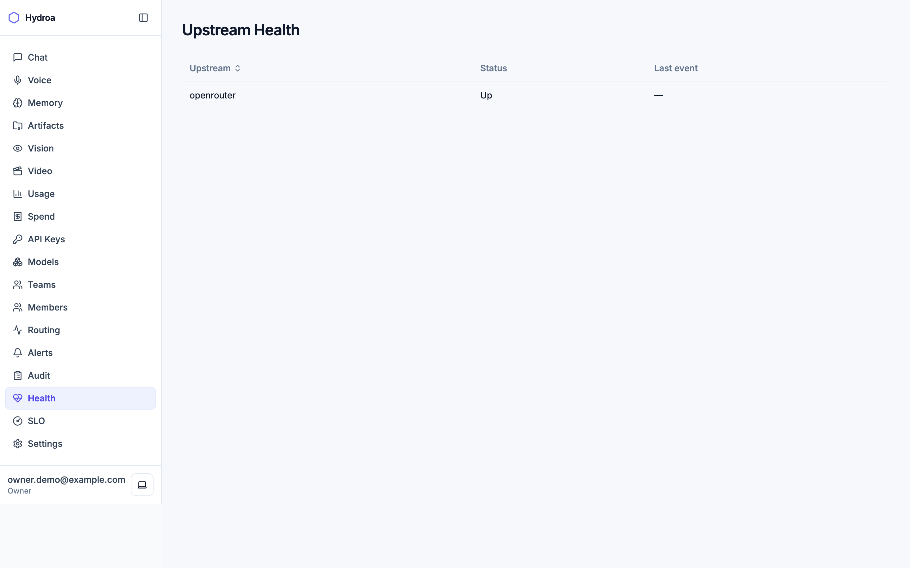

Per-upstream up/down status. Only OpenRouter is actively pinged; providers without
a health pinger are deliberately omitted (no fake-green rows). Maps to
`/admin/health/upstreams`.

---

## Chat playground

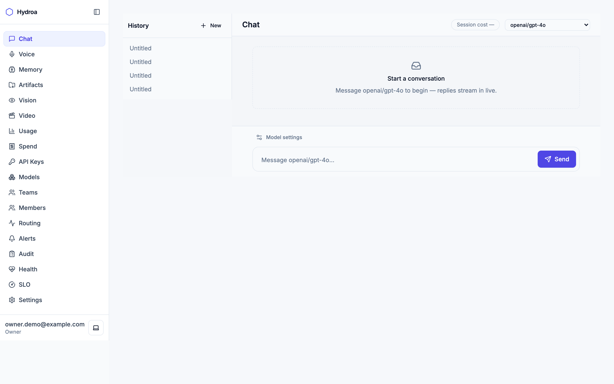

An in-dashboard chat client: a **History** sidebar, a **model picker**, live
streaming replies, and a per-session **cost** readout. The **model picker** reads the
catalog from `/admin/catalog/models` (JWT/admin plane). The **Send** action targets
`/v1/chat/completions` — a *data-plane* path that requires an `sk-`/agent token, which
the session-cookie BFF does not supply, so Send currently returns an _“API key
required”_ error (it no longer logs you out — see the note under
[AI-app pages](#ai-app-pages)). The companion **Voice**, **Vision**, and **Video**
pages share that model-picker behavior.

---

## Settings

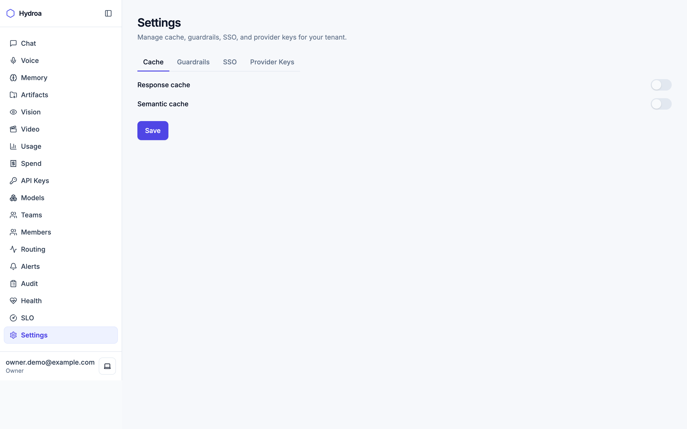

Tenant-level configuration — cache toggles, guardrails (prompt-injection / PII),
and (owner-only) BYOK **provider keys** and **SSO/OIDC**. Maps to `/admin/cache`,
`/admin/guardrails`, `/admin/provider-keys`, `/admin/oidc`.

---

## AI-app pages

The sidebar’s top group exposes the [AI-application features](./03-api-client-guide.md#ai-app-features)
as ready-made UIs:

| Page | Backs onto | API |
|------|-----------|-----|
| **Chat** | streaming chat | `/v1/chat/completions` |
| **Voice** | realtime / TTS / STT | `/v1/realtime`, `/v1/audio/*` |
| **Memory** | semantic memory | `/v1/memories` |
| **Artifacts** | file store | `/v1/artifacts` |
| **Vision** | image understanding | `/v1/chat/completions` (multimodal) |
| **Video** | async video jobs | `/v1/video/generations` |

> **Note (verified live):** two different planes are in play here. The **model
> pickers** read `/admin/catalog/models` — the JWT/admin-plane twin of `/v1/models`,
> so they work with your session cookie. The **completion actions** (Send / Ask /
> Generate) hit `/v1/*`, which require an `sk-`/agent token, *not* the session JWT —
> the BFF only carries your session, so these currently return an _“API key required”_
> error. They no longer log you out: the BFF only clears your session on a
> control-plane (`/admin/*`) 401, never on a data-plane (`/v1/*`) one. To actually run
> a completion against `/v1/*`, use an `sk-` key (see the
> [API client guide](./03-api-client-guide.md)).

---

**Back to:** [README](./README.md) · [02 Admin guide](./02-admin-guide.md) ·
[03 API client guide](./03-api-client-guide.md) · [05 Troubleshooting](./05-troubleshooting.md)
